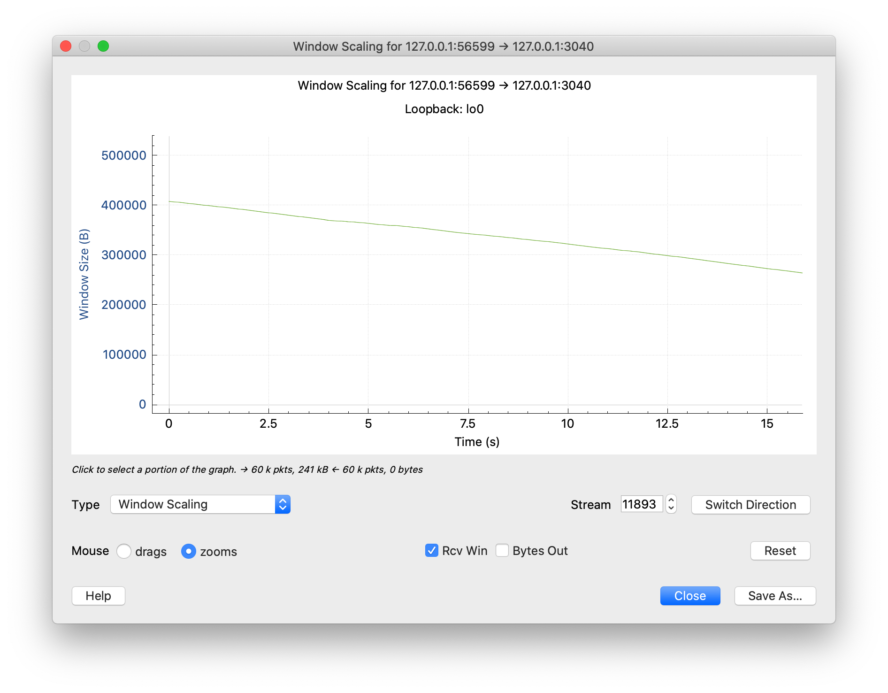
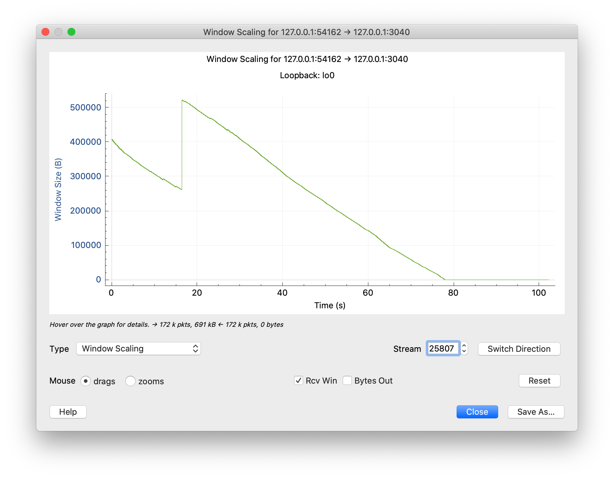

# Flowcontrol

This example recreates the one in https://www.brianstorti.com/tcp-flow-control/

## Advertised window size

1. Start wireshark on loopback and put the following display filter:

        tcp.port == 3040 && ip.addr == 127.0.0.1

2. Start the server:

        $ go run .

3. Use netcat to test the connection:

        $ nc localhost 3040

4. Look in the wireshark:

        5468	103.227014	127.0.0.1	127.0.0.1	TCP	56	63553 → 3040 [FIN, ACK] Seq=1 Ack=1 Win=408256 Len=0 TSval=885134572 TSecr=885125926

    `Win=408256` is the advertised window size

## Receiver keeps up with the sender

1. Keep the wireshark up and restart the server

2. Overwrite a file in a loop:

        $ while true; do echo "foo" > stream.txt; done
        
3. Pipe the updates to the server:

        $ tail -f stream.txt | nc localhost 3040

4. Notice how the window size shrinks, but the reader seems to keep up. Also check **Statistics** -> **TCP graphs** -> **Window scaling** in wireshark.

    

## Receiver can't keep up

Now, let's try to simulate a slow reader.

1. Keep the wireshark up and restart the server with a some delay after printing each line:

        $ go run . -sleep "1s"

2. Overwrite a file in a loop:

        $ while true; do echo "foo" > stream.txt; done
        
3. Pipe the updates to the server:

        $ tail -f stream.txt | nc localhost 3040

4. Notice how the window size shrinks and eventually goes to zero (I'm not sure why this sawtooth bump in the middle), maybe the OS increased the buffer.

    

5. Also notice the _persist timer_ -- after the sender is stopped, because there's no more room in the buffer, it will periodically send `ZeroWindowProbe` to check if the receiver is ready.

        523128	1065.032198	127.0.0.1	127.0.0.1	TCP	57	[TCP ZeroWindowProbe] 54162 → 3040 [ACK] Seq=691825 Ack=1 Win=408256 Len=1 TSval=886063208 TSecr=886058193

